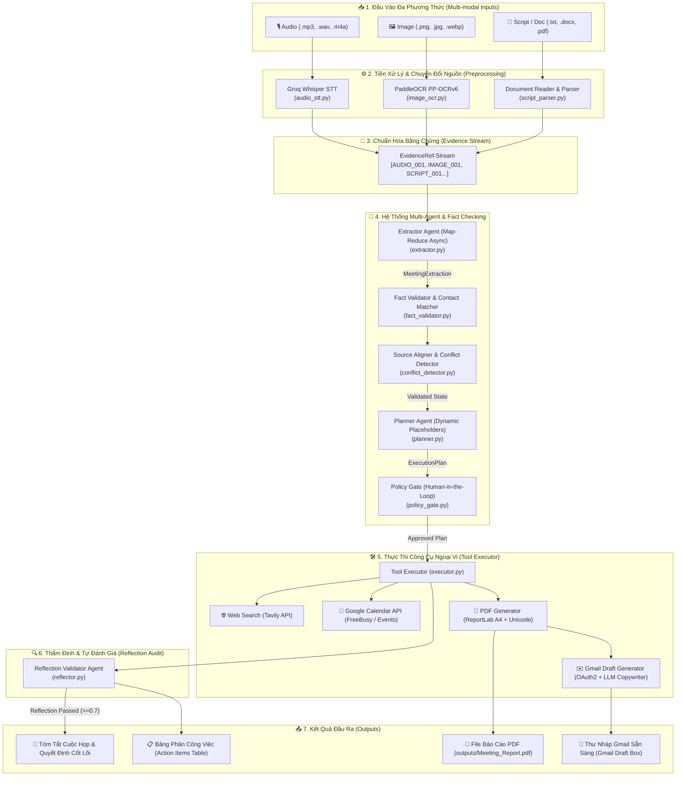
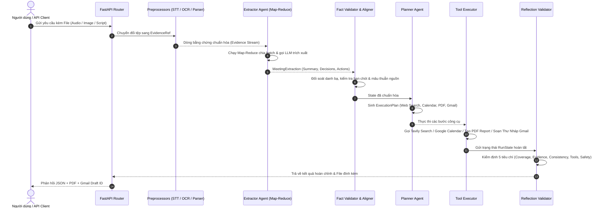

# 🚀 Multi-modal Smart Personal Assistant

<div align="center">

[](https://www.python.org/)
[](https://fastapi.tiangolo.com/)
[](https://www.langchain.com/)
[](https://groq.com/)
[](https://github.com/PaddlePaddle/PaddleOCR)
[](LICENSE)

**Hệ thống Trợ lý Cá nhân Đa phương thức thông minh (Multi-modal Smart Personal Assistant)**
*Tự động hóa toàn diện quy trình tiếp nhận, phân tích cuộc họp đa nguồn, lập kế hoạch thực thi công cụ và khởi tạo báo cáo / thư điện tử chuyên nghiệp.*

[Tính Năng](#-tính-năng-nổi-bật) • [Kiến Trúc](#-kiến-trúc-hệ-thống--pipeline) • [Cài Đặt](#-hướng-dẫn-cài-đặt) • [Google OAuth](#-cấu-hình-google-oauth2) • [Sử Dụng](#-hướng-dẫn-sử-dụng) • [Cấu Trúc Thư Mục](#-cấu-trúc-thư-mục)

</div>

---

## 📖 Giới Thiệu Tổng Quan

**Multi-modal Smart Personal Assistant** là giải pháp trợ lý AI tự hành (Autonomous Multi-Agent System) được thiết kế để xử lý dữ liệu cuộc họp phức tạp từ nhiều phương thức đầu vào khác nhau:
1. **Âm thanh cuộc họp (Audio)**: Ghi âm trao đổi thoại (.mp3, .wav, .m4a) $\rightarrow$ Speech-to-Text qua Groq Whisper.
2. **Hình ảnh tài liệu (Image)**: Slide trình chiếu, biên bản viết tay, bảng trắng (.png, .jpg) $\rightarrow$ OCR tiếng Việt chuyên sâu qua PaddleOCR.
3. **Văn bản kịch bản (Script/Doc)**: Biên bản họp, ghi chép thô (.txt, .md, .docx, .pdf) $\rightarrow$ Phân tích cấu trúc hội thoại.

Hệ thống điều phối các Agent thông minh để:
- **Trích xuất thông tin** (Summary, Decisions, Action Items) song song theo cơ chế Map-Reduce.
- **Truy vết bằng chứng chéo** (Cross-modal Evidence Linking) chống ảo giác (Anti-Hallucination).
- **Lập kế hoạch công việc** (Execution Planner) và kiểm soát an toàn (Policy Gate).
- **Thực thi công cụ ngoại vi**: Tra cứu web đối tác (Tavily), kiểm tra lịch Google Calendar, xuất báo cáo PDF chuẩn A4 tiếng Việt và tự động soạn bản nháp email Gmail.
- **Thẩm định chất lượng (Reflection Audit)**: Đánh giá 5 tiêu chí trước khi hoàn tất phiên làm việc.

---

## 📐 Kiến Trúc Hệ Thống & Pipeline

### 1. Sơ đồ Luồng Xử lý Toàn diện (System Architecture Pipeline)



---

### 2. Sơ đồ Tuần Tự Tương Tác (Sequence Flow)



---

## ✨ Tính Năng Nổi Bật

| Tính năng | Chi tiết kỹ thuật |
| :--- | :--- |
| 🎙️ **Multi-modal Ingestion** | Tích hợp **Groq Whisper** (nhận diện giọng nói siêu tốc) và **PaddleOCR PP-OCRv6** (nhận diện chữ tiếng Việt chính xác cao). |
| ⚡ **Map-Reduce Parallel Extraction** | Bóc tách thông tin song song theo từng batch bằng LLM bất đồng bộ (`ainvoke`), hỗ trợ xử lý biên bản họp dài mà không lo tràn context window. |
| 🛡️ **Anti-Hallucination Evidence Tracking** | Mọi Action Item và Decision đều được liên kết trực tiếp với mã định danh bằng chứng gốc (`AUDIO_001`, `IMAGE_002`, `SCRIPT_003`). |
| 🔍 **Cross-Source Conflict Detection** | Tự động phát hiện khi có sự bất đồng thông tin giữa các nguồn (ví dụ: Audio nói một đằng, Slide ghi một nẻo) và đánh dấu trạng thái `CONFLICTED`. |
| 📅 **Google Calendar Integration** | Tự động tra cứu lịch rảnh (`freebusy`) của các thành viên tham gia và đề xuất khung giờ họp tiếp theo. |
| 📄 **Professional PDF Generator** | Tạo báo cáo cuộc họp PDF chuẩn A4, hỗ trợ đầy đủ phông chữ tiếng Việt Unicode (`DejaVuSans`), kẻ bảng và định dạng chuyên nghiệp. |
| ✉️ **Executive Email Copywriter** | Tự động dùng LLM biên soạn email báo cáo trang trọng, tự nhiên theo văn phong công sở và đẩy trực tiếp vào mục **Thư nháp (Drafts)** của Gmail qua OAuth2. |
| 🧠 **Self-Correction & Reflection** | Đánh giá lại toàn bộ kết quả qua 5 tiêu chí: *Coverage, Evidence, Consistency, Tool Execution, Safety*. Tự động kích hoạt cơ chế `repair_output` hoặc `ask_user` khi có sự cố. |

---

## 📁 Cấu Trúc Thư Mục

```text
Multi-modal-Smart-Personal-Assistant/
├── app/
│   ├── agents/                   # Các tác tử thông minh (Multi-Agent System)
│   │   ├── extractor.py          # Map-Reduce Information Extractor
│   │   ├── planner.py            # Execution Plan Generator
│   │   ├── policy_gate.py        # Kiểm soát chính sách & an toàn
│   │   └── reflector.py          # Reflection Validator & Self-Correction
│   ├── api/                      # Tầng giao diện REST API
│   │   └── routes.py             # FastAPI Endpoints
│   ├── core/                     # Cấu hình & Tiện ích cốt lõi
│   │   ├── config.py             # Pydantic Settings & Quản lý Env
│   │   ├── constants.py          # Enums & System Constants
│   │   ├── exceptions.py         # Custom Exception Classes
│   │   ├── json_utils.py         # Trích xuất & tự sửa lỗi JSON payload
│   │   └── prompts.py            # Hệ thống Prompt chuẩn hóa
│   ├── orchestration/            # Điều phối quy trình (Workflow)
│   │   ├── conflict_detector.py  # Phát hiện xung đột dữ liệu đa nguồn
│   │   ├── executor.py           # Bộ thực thi kế hoạch công cụ
│   │   ├── source_aligner.py     # Căn chỉnh ngữ nghĩa đa phương thức
│   │   └── workflow.py           # Luồng điều phối End-to-End
│   ├── schemas/                  # Pydantic Schemas & DTOs
│   │   ├── evidence.py           # EvidenceRef schema
│   │   ├── execution.py          # ExecutionPlan & PlanStep schema
│   │   ├── extraction.py         # ActionItem & MeetingExtraction
│   │   ├── state.py              # RunState schema
│   │   └── validation.py         # FactValidation & ReflectionResult
│   ├── services/                 # Tầng Dịch vụ & Kết nối
│   │   ├── contact_repository.py # Quản lý danh bạ liên hệ
│   │   ├── document_reader.py    # Bộ đọc tệp văn bản đa định dạng
│   │   ├── llm_service.py        # Khởi tạo kết nối ChatGroq / OpenRouter
│   │   ├── oauth_service.py      # Xác thực Google OAuth2 (Calendar & Gmail)
│   │   └── storage_service.py    # Quản lý lưu trữ tệp & hashing SHA256
│   ├── tools/                    # Tập hợp Công cụ ngoại vi (Tools)
│   │   ├── audio_stt.py          # Chuyển đổi giọng nói thành văn bản
│   │   ├── fact_validator.py     # Thẩm định bằng chứng & chuẩn hóa danh bạ
│   │   ├── gmail_draft.py        # Tạo bản nháp email Gmail
│   │   ├── google_calendar.py    # Kiểm tra & quản lý Google Calendar
│   │   ├── image_ocr.py          # Nhận diện chữ tiếng Việt từ hình ảnh
│   │   ├── pdf_generator.py      # Sinh báo cáo PDF ReportLab
│   │   ├── script_parser.py      # Phân tích kịch bản họp
│   │   └── web_search.py         # Tra cứu thông tin web (Tavily)
│   └── main.py                   # FastAPI Application Entrypoint
├── assets/fonts/                 # Phông chữ tiếng Việt (DejaVuSans.ttf)
├── credentials/                  # Thư mục chứa khóa Google OAuth2 (bảo mật)
├── data/
│   ├── contacts.json             # Cơ sở dữ liệu danh bạ mẫu
│   ├── inputs/                   # Thư mục lưu tệp đầu vào
│   └── temp/                     # Thư mục lưu tệp tạm
├── outputs/                      # Thư mục xuất báo cáo PDF
├── .env.example                  # File mẫu biến môi trường
├── .gitignore                    # Quy tắc loại trừ Git (Bảo vệ bí mật)
├── requirements.txt              # Danh sách thư viện phụ thuộc
└── README.md                     # Tài liệu hướng dẫn dự án
```

---

## 🛠️ Hướng Dẫn Cài Đặt

### 1. Yêu Cầu Môi Trường
- **Python**: Phiên bản `3.10` trở lên (Khuyến nghị dùng `Python 3.10` hoặc `3.11`).
- **Conda / Virtualenv** để cô lập môi trường.

### 2. Cài Đặt Các Gói Phụ Thuộc
```bash
# 1. Clone repository
git clone https://github.com/tutran27/multimodal-meeting-assistant.git
cd multimodal-meeting-assistant

# 2. Tạo và kích hoạt môi trường ảo
python -m venv .venv
source .venv/bin/activate   # Trên Linux/macOS
# .venv\Scripts\activate    # Trên Windows

# 3. Cài đặt thư viện
pip install --upgrade pip
pip install -r requirements.txt
```

---

## 🔐 Cấu Hình Google OAuth2 & Biến Môi Trường

### 1. Cấu hình File `.env`
Sao chép file `.env.example` thành `.env` và điền các khóa API tương ứng:

```bash
cp .env.example .env
```

```env
# --- Cấu hình chung ---
ENV=development
DEBUG=True

# --- PaddleOCR ---
PADDLE_PDX_DISABLE_MODEL_SOURCE_CHECK=True

# --- Google Calendar & Gmail API ---
GOOGLE_ENABLED=true
GOOGLE_CLIENT_SECRET_PATH=credentials/credentials.json
GOOGLE_TOKEN_PATH=credentials/token_calendar.json
GOOGLE_CALENDAR_ID=primary
DEFAULT_BOSS_EMAIL=boss@example.com

# --- LLM API Keys (Groq) ---
GROQ_API_KEY=gsk_your_groq_api_key_here
GROQ_LLM_MODEL=llama-3.1-8b-instant
GROQ_STT_MODEL=whisper-large-v3-turbo

# --- OpenRouter (Tùy chọn) ---
OPENROUTER_API_KEY=your_openrouter_api_key_here
OPENROUTER_LLM_MODEL=qwen/qwen-2.5-72b-instruct

# --- Tra cứu Web (Tavily Search) ---
SEARCH_PROVIDER=tavily
TAVILY_API_KEY=tvly-your_tavily_api_key_here

# --- Hugging Face Token (Reranker & Models) ---
HF_TOKEN=your_huggingface_token_here

# --- LangSmith Tracing (Tùy chọn giám sát) ---
LANGCHAIN_TRACING_V2=false
LANGCHAIN_ENDPOINT=https://api.smith.langchain.com
LANGCHAIN_API_KEY=your_langchain_api_key_here
LANGCHAIN_PROJECT=smart-personal-assistant
```

### 2. Cài Đặt Google OAuth (Calendar & Gmail)
1. Truy cập [Google Cloud Console](https://console.cloud.google.com/) $\rightarrow$ Tạo một Project mới.
2. Bật 2 thư viện API:
   - **Google Calendar API**
   - **Gmail API**
3. Cấu hình **OAuth consent screen** (Chọn *External*, thêm email của bạn vào danh sách *Test Users*).
4. Vào mục **Credentials** $\rightarrow$ **Create Credentials** $\rightarrow$ **OAuth client ID** (Loại ứng dụng: **Desktop App**).
5. Tải file JSON vừa tạo về và lưu vào: `credentials/credentials.json`.
6. Khi chạy công cụ lần đầu, trình duyệt sẽ tự động bật lên để bạn đăng nhập và cấp quyền; file `credentials/token_calendar.json` sẽ được sinh ra tự động.

---

## 🚀 Hướng Dẫn Sử Dụng

### 1. Chạy Thử Nghiệm Từng Công Cụ Độc Lập (CLI Testing)

```bash
# 🎙️ Kiểm tra Speech-to-Text âm thanh:
python -m app.tools.audio_stt "path/to/meeting_audio.mp3"

# 🖼️ Kiểm tra OCR hình ảnh:
python -m app.tools.image_ocr "path/to/whiteboard_slide.png"

# 📄 Kiểm tra phân tích kịch bản cuộc họp:
python -m app.tools.script_parser

# 🔍 Kiểm tra Fact Validator & Tra danh bạ:
python -m app.tools.fact_validator

# 🌐 Kiểm tra Web Search đối tác:
python -m app.tools.web_search "Công ty Cổ phần Công nghệ ABC"

# 📅 Kiểm tra tra cứu Google Calendar:
python -m app.tools.google_calendar

# 📄 Kiểm tra tạo file PDF Báo cáo:
python -m app.tools.pdf_generator

# ✉️ Kiểm tra tạo Bản nháp Email Gmail:
python -m app.tools.gmail_draft
```

---

### 2. Khởi Động Máy Chủ REST API (FastAPI)

```bash
python -m app.main
```
Hoặc:
```bash
uvicorn app.main:app --host 0.0.0.0 --port 8000 --reload
```

* Swagger UI tài liệu API trực quan: [http://localhost:8000/docs](http://localhost:8000/docs)
* Healthcheck: [http://localhost:8000/api/v1/health](http://localhost:8000/api/v1/health)

---

### 3. Gọi API Xử lý Cuộc Họp Toàn Diện (`/api/v1/process-meeting`)

Gửi request đa phương thức (gồm file ghi âm, file ảnh bảng trắng và ghi chép cuộc họp):

```bash
curl -X POST "http://localhost:8000/api/v1/process-meeting" \
  -H "accept: application/json" \
  -H "Content-Type: multipart/form-data" \
  -F "user_request=Trích xuất toàn bộ việc cần làm, kiểm tra lịch tuần sau và soạn email nháp gửi sếp" \
  -F "audio_file=@data/inputs/meeting_recording.mp3" \
  -F "image_file=@data/inputs/whiteboard_note.jpg" \
  -F "script_file=@data/inputs/meeting_minutes.docx"
```

---

## 🛡️ Chính Sách An Toàn & Bảo Mật

1. **Human-in-the-Loop Email Draft**:
   - Hệ thống được cấu hình mặc định `ENABLE_EMAIL_SEND=false`. 
   - AI **chỉ tạo bản nháp (Draft)** trong hòm thư Gmail của bạn, tuyệt đối không tự ý gửi thư đi khi chưa có sự xác nhận của người dùng.
2. **Policy Gate Check**:
   - Mọi thao tác ghi dữ liệu vào Google Calendar hay gửi thông tin ra ngoài đều phải qua bước kiểm tra chính sách an toàn.
3. **Bảo Vệ Bí Mật Tuyệt Đối**:
   - Tất cả các file token, client secrets và file `.env` chứa API key đều đã được thiết lập quy tắc trong `.gitignore` để không bao giờ bị lộ lên hệ thống quản lý mã nguồn.

---

## 🤝 Đóng Góp & Phát Triển

Dự án mở cho các đóng góp nâng cao tính năng:
- [ ] Mở rộng tích hợp họp trực tuyến (Zoom / Google Meet webhook).
- [ ] Tích hợp RAG tra cứu tri thức doanh nghiệp chuyên sâu.
- [ ] Hỗ trợ đa ngôn ngữ (Tiếng Anh, Tiếng Nhật).

Nếu bạn có bất kỳ thắc mắc hay đề xuất cải tiến nào, hãy tạo một **Issue** hoặc gửi **Pull Request**!

---

<div align="center">
  <sub>Phát triển với sự tận tâm và tiêu chuẩn kỹ thuật cao cấp dành cho Trợ lý AI thế hệ mới.</sub>
</div>
