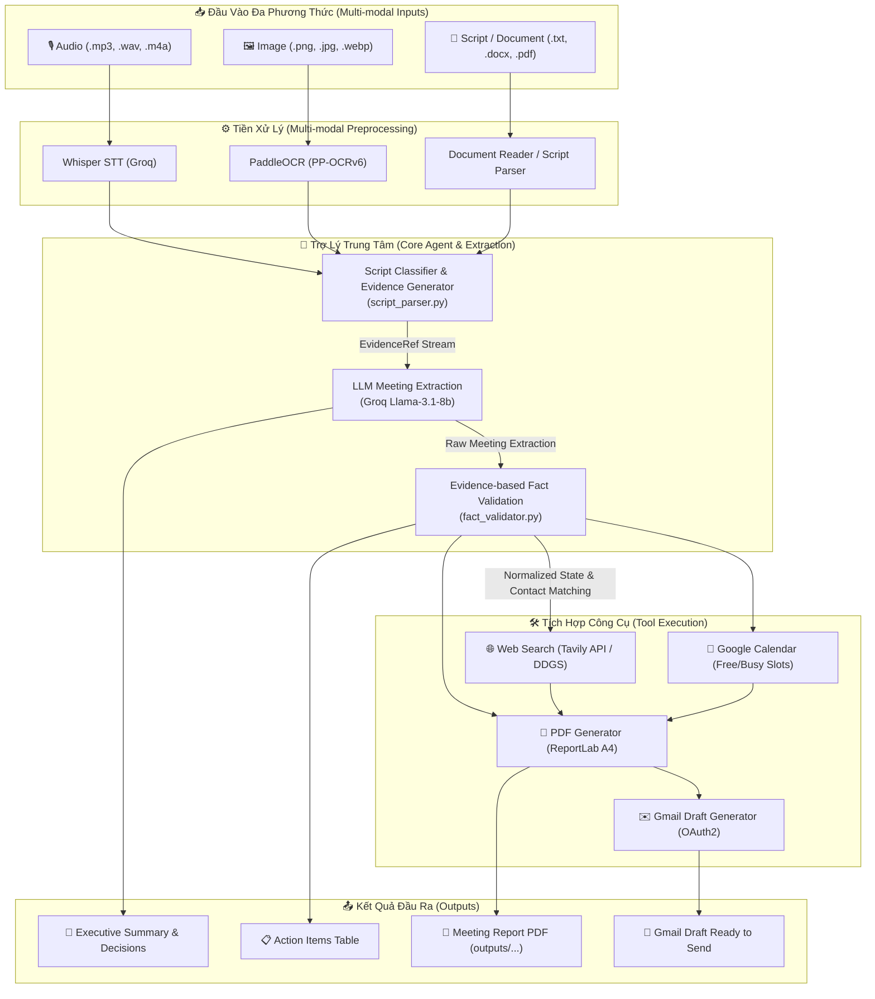
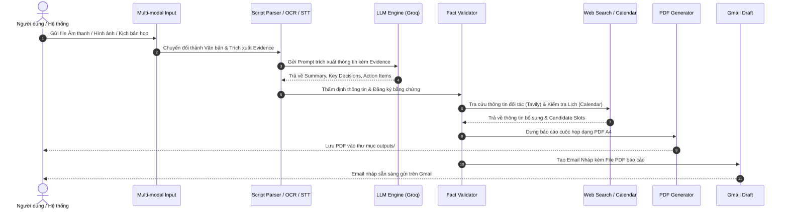

# 🚀 Multi-modal Smart Personal Assistant

Hệ thống Trợ lý Cá nhân Đa phương thức thông minh (Multi-modal Smart Personal Assistant) giúp tự động hóa toàn bộ quy trình xử lý cuộc họp: từ tiếp nhận âm thanh (STT), hình ảnh (OCR), kịch bản văn bản đến phân tích trích xuất thông tin (LLM), thẩm định bằng chứng, tra cứu thông tin đối tác, kiểm tra lịch và xuất báo cáo PDF / tạo email nháp (Gmail).

---

## 📐 Sơ đồ Pipeline & Kiến trúc Hệ thống

### 1. Sơ đồ Luồng Xử lý Chi tiết (Processing Pipeline)



---

### 2. Sơ đồ Tuần Tự (Sequence Diagram)



---

## ✨ Tính Năng Nổi Bật

- **Xử lý Đa phương thức (Multi-modal Integration)**: Tích hợp Groq Whisper (STT) và PaddleOCR (PP-OCRv6) giúp đọc thông tin từ âm thanh, hình ảnh và văn bản.
- **Bóc tách & Truy vết Bằng chứng (`EvidenceRef`)**: Mọi quyết định và công việc trích xuất từ cuộc họp đều có ID bằng chứng trích dẫn cụ thể (`SCRIPT_001`, `SCRIPT_002`), chống bịa đặt (Hallucination).
- **Thẩm định Thực tế & Danh bạ (`fact_validator.py`)**: Tự động tra cứu danh bạ (`ContactRepository`), kiểm tra định dạng email và phát hiện hạn chót trong quá khứ (`past_deadline`).
- **Tra cứu Web Thông minh (`web_search.py`)**: Sử dụng **Tavily Search API** (fallback DuckDuckGo) để tự động làm giàu thông tin đối tác.
- **Xuất Báo cáo PDF Chuyên nghiệp (`pdf_generator.py`)**: Tự động sinh file PDF chuẩn khổ A4, trình bày đẹp mắt, hỗ trợ tiếng Việt Unicode với phông chữ Times New Roman / Arial.
- **Soạn Email Nháp Tự động (`gmail_draft.py`)**: Tích hợp Google OAuth2 để tạo bản nháp email đính kèm báo cáo PDF gửi sếp/đối tác.

---

## 📁 Cấu Trúc Thư Mục Dự Án

```text
Multi-modal Smart Personal Assistant/
├── app/
│   ├── core/
│   │   ├── config.py             # Cấu hình Pydantic Settings & Biến môi trường
│   │   ├── constants.py          # Enum & Hằng số hệ thống
│   │   └── exceptions.py         # Custom Exception Classes
│   ├── schemas/
│   │   ├── evidence.py           # Schema Bằng chứng (EvidenceRef)
│   │   ├── extraction.py         # Schema Trích xuất (ActionItem, MeetingExtraction)
│   │   ├── state.py              # Schema trạng thái RunState
│   │   └── validation.py         # Schema Thẩm định dữ liệu
│   ├── services/
│   │   ├── contact_repository.py # Quản lý danh bạ (JSON Storage)
│   │   ├── document_reader.py    # Đọc tài liệu (.txt, .docx, .pdf)
│   │   ├── oauth_service.py      # Xử lý Google OAuth2 Authentication
│   │   └── storage_service.py    # Quản lý lưu trữ & Mã hóa SHA256
│   └── tools/
│       ├── fact_validator.py     # Thẩm định bằng chứng & danh bạ
│       ├── gmail_draft.py        # Tạo Email Draft trên Gmail
│       ├── pdf_generator.py      # Sinh file báo cáo PDF A4
│       ├── script_parser.py     # Phân loại & bóc tách kịch bản họp
│       └── web_search.py        # Tra cứu Web (Tavily / DuckDuckGo)
├── data/
│   ├── contacts.json             # Danh bạ người dùng
│   ├── inputs/                   # Thư mục chứa dữ liệu đầu vào
│   └── temp/                     # Thư mục lưu tệp tạm
├── outputs/                      # Thư mục chứa báo cáo PDF đầu ra
├── assets/fonts/                 # Phông chữ Unicode (Times New Roman, Arial)
├── .env.example                  # Mẫu cấu hình biến môi trường
├── requirements.txt              # Danh sách thư viện phụ thuộc
└── README.md                     # Tài liệu hướng dẫn dự án
```

---

## 🛠️ Hướng Dẫn Cài Đặt & Cấu Hình

### 1. Yêu cầu hệ thống
- Python 3.10+
- Anaconda / Miniconda (Khuyến nghị)

### 2. Cài đặt Môi trường
```bash
# Tạo và kích hoạt môi trường conda
conda create -n smart-personal-assistant python=3.10 -y
conda activate smart-personal-assistant

# Cài đặt các gói phụ thuộc
pip install -r requirements.txt
pip install reportlab tavily-python duckduckgo-search
```

### 3. Cấu hình Biến môi trường (`.env`)
Tạo file `.env` tại thư mục gốc dự án dựa trên mẫu dưới đây:

```env
# General
APP_ENV=development
DEBUG=True

# Groq LLM & STT
GROQ_API_KEY=gsk_your_groq_api_key_here
GROQ_LLM_MODEL=llama-3.1-8b-instant

# Web Search (Tavily)
SEARCH_PROVIDER=tavily
TAVILY_API_KEY=tvly-your_tavily_api_key_here

# Google Integration (Tùy chọn)
GOOGLE_ENABLED=False
DEFAULT_BOSS_EMAIL=boss@company.com
```

---

## 🚀 Hướng Dẫn Sử Dụng & Kiểm Thử Công Cụ

Bạn có thể chạy thử từng công cụ độc lập thông qua giao diện dòng lệnh:

```bash
# 1. Phân tích kịch bản cuộc họp
python -m app.tools.script_parser

# 2. Thẩm định dữ liệu & Danh bạ
python -m app.tools.fact_validator

# 3. Tra cứu Web thông minh (Tavily API)
python -m app.tools.web_search

# 4. Xuất Báo cáo PDF Cuộc họp
python -m app.tools.pdf_generator

# 5. Khởi tạo Email Draft (Cần cài đặt GOOGLE_ENABLED=True)
python -m app.tools.gmail_draft
```

---

## 📜 Giấy Phép & Đóng Góp
Dự án được phát triển phục vụ mục đích cá nhân và doanh nghiệp. 
Mọi đóng góp (Pull Request / Issue) luôn được hoan nghênh!
